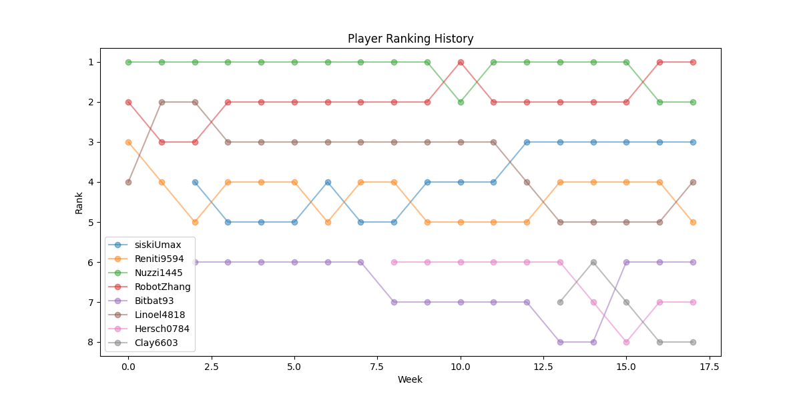
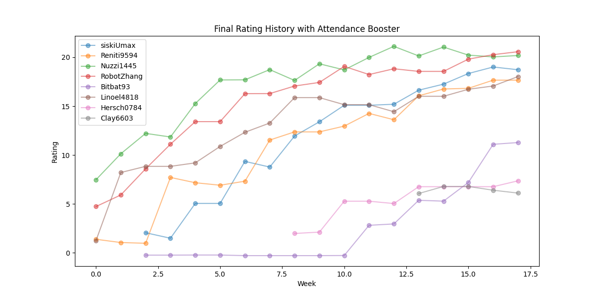
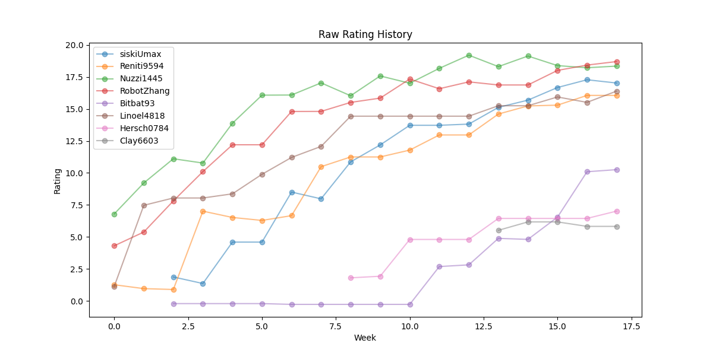

# CASA Colonist Rating

Author: Shitian Zhang

This repository is for calculating the performance of CASA players in [Colonist](https://colonist.io/).

See [main.ipynb](main.ipynb) for the code and results.

## Latest Results

Until: 19 June 2026

|ID        |Skill μ|Skill σ|Raw Rating|Attendance Booster|Final Rating|
|----------|-------|-------|----------|------------------|------------|
|RobotZhang|26.242 |2.513  |18.702    |🐑🐑              |20.572      |
|Nuzzi1445 |25.519 |2.391  |18.346    |🐑🐑              |20.181      |
|siskiUmax |24.952 |2.642  |17.025    |🐑🐑              |18.728      |
|Linoel4818|25.225 |2.944  |16.393    |🐑🐑              |18.032      |
|Reniti9594|23.72  |2.554  |16.058    |🐑🐑              |17.663      |
|Bitbat93  |20.347 |3.363  |10.259    |🐑🐑              |11.285      |
|Hersch0784|19.499 |4.16   |7.018     |🐑                |7.369       |
|Clay6603  |20.9   |5.025  |5.826     |🐑                |6.118       |

# History





# Calculation Method

The rating is calculated using the [TrueSkill](https://trueskill.org/) algorithm, which is a Bayesian ranking system that takes into account both the skill level and the uncertainty of each player. The raw rating is calculated as `Skill_μ - 3 * Skill_σ`, which gives a conservative estimate of the player's skill. As a player play more games, their uncertainty (σ) will decrease, and their raw rating will slightly improve in the long run.

The attendance booster applied to the raw rating to get the final rating. It is calculated as follows. You get 🐑 if you attend at least one game in the recent 4 games, or 🐑🐑 if you attend more than two games. Each 🐑 gives you +5%! 

|Attendance in the recent 4 games|Attendance Booster|
|-------------------------------|----------|
|4                              |🐑🐑(+10%)       |
|3                              |🐑🐑(+10%)       |
|2                              |🐑(+5%)       |
|1                              |🐑(+5%)       |
|0                              |0       |

## Setup

Use the following commands to set up the environment:

```
git clone https://github.com/ShitianZhang22/CASA-Colonist-Rating.git
pip install -r requirements.txt
```
